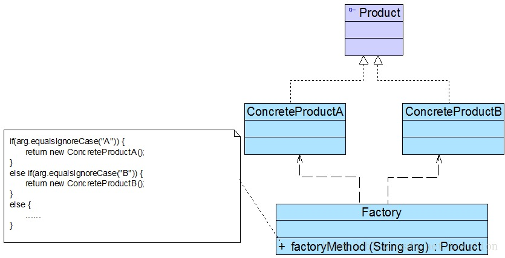

# simple-factory-pattern

工厂模式是最常用的一类创建型设计模式，通常我们所说的工厂模式是指工厂方法模式，它也是使用频率最高的工厂模式。本章将要学习的简单工厂模式是工厂方法模式的“小弟”，它不属于GoF 23种设计模式，但在软件开发中应用也较为频繁，通常将它作为学习其他工厂模式的入门。此外，工厂方法模式还有一位“大哥”——抽象工厂模式。这三种工厂模式各具特色，难度也逐个加大，在软件开发中它们都得到了广泛的应用，成为面向对象软件中常用的创建对象的工具。

### 原始的方式
在`chart.java`中,有很多问题:
1. 包含很多“if…else…”代码块，整个类的代码相当冗长，代码越长，阅读难度、维护难度和测试难度也越大；而且大量条件语句的存在还将影响系统的性能，程序在执行过程中需要做大量的条件判断。
2. Chart类的职责过重，它负责初始化和显示所有的图表对象，将各种图表对象的初始化代码和显示代码集中在一个类中实现，违反了“单一职责原则”，不利于类的重用和维护；而且将大量的对象初始化代码都写在构造函数中将导致构造函数非常庞大，对象在创建时需要进行条件判断，降低了对象创建的效率
3. 当需要增加新类型的图表时，必须修改Chart类的源代码，违反了“开闭原则”
4. 客户端只能通过new关键字来直接创建Chart对象，Chart类与客户端类耦合度较高，对象的创建和使用无法分离
5. 客户端在创建Chart对象之前可能还需要进行大量初始化设置，例如设置柱状图的颜色、高度等，如果在Chart类的构造函数中没有提供一个默认设置，那就只能由客户端来完成初始设置，这些代码在每次创建Chart对象时都会出现，导致代码的重复

### 二丶引入简单工厂模式(pattern包下)
简单工厂模式的要点在于：当你需要什么，只需要传入一个正确的参数，就可以获取你所需要的对象，而无须知道其创建细节。简单工厂模式结构比较简单，其核心是工厂类的设计，其结构如图所示：


- **Factory（工厂角色）**：工厂角色即工厂类，它是简单工厂模式的核心，负责实现创建所有产品实例的内部逻辑；工厂类可以被外界直接调用，创建所需的产品对象；在工厂类中提供了静态的工厂方法factoryMethod()，它的返回类型为抽象产品类型Product。

- **Product（抽象产品角色）**：它是工厂类所创建的所有对象的父类，封装了各种产品对象的公有方法，它的引入将提高系统的灵活性，使得在工厂类中只需定义一个通用的工厂方法，因为所有创建的具体产品对象都是其子类对象。

- **ConcreteProduct（具体产品角色）**：它是简单工厂模式的创建目标，所有被创建的对象都充当这个角色的某个具体类的实例。每一个具体产品角色都继承了抽象产品角色，需要实现在抽象产品中声明的抽象方法。

在简单工厂模式中，客户端通过工厂类来创建一个产品类的实例，而**无须直接使用new关键字来创建对象**，它是工厂模式家族中最简单的一员。

在使用简单工厂模式时，首先需要对产品类进行重构，**不能设计一个包罗万象的产品类，而需根据实际情况设计一个产品层次结构**，将所有产品类公共的代码移至抽象产品类，并在抽象产品类中声明一些抽象方法，以供不同的具体产品类来实现，典型的抽象产品类代码如下所示
```java
abstract class Product {  
    //所有产品类的公共业务方法  
    public void methodSame() {  
        //公共方法的实现  
    }  
  
    //声明抽象业务方法  
    public abstract void methodDiff();  
}
```
在具体产品类中实现了抽象产品类中声明的抽象业务方法，不同的具体产品类可以提供不同的实现，典型的具体产品类代码如下所示
```java
class ConcreteProduct extends Product {  
    //实现业务方法  
    public void methodDiff() {
        //业务方法的实现
    }
}
```
简单工厂模式的核心是工厂类，在没有工厂类之前，客户端一般会使用new关键字来直接创建产品对象，而在引入工厂类之后，客户端可以通过工厂类来创建产品，在简单工厂模式中，工厂类提供了一个静态工厂方法供客户端使用，根据所传入的参数不同可以创建不同的产品对象，典型的工厂类代码如下所示：
```java
class Factory {  
    //静态工厂方法  
    public static Product getProduct(String arg) {  
        Product product = null;  
        if (arg.equalsIgnoreCase("A")) {  
            product = new ConcreteProductA();  
            //初始化设置product  
        }
        else if (arg.equalsIgnoreCase("B")) {  
            product = new ConcreteProductB();  
            //初始化设置product  
        }
        return product;
    }
}
```
在客户端代码中，我们通过调用工厂类的工厂方法即可得到产品对象，典型代码如下所示：
```java
class Client {  
    public static void main(String args[]) {  
        Product product;   
        product = Factory.getProduct("A"); //通过工厂类创建产品对象  
        product.methodSame();  
        product.methodDiff();  
    }  
}  
```

### 三丶完整解决方案(面向接口编程-patternComplete包下)
为了将Chart类的职责分离，同时将Chart对象的创建和使用分离,重构后的结构如图所示

在图中，Chart接口充当抽象产品类，其子类HistogramChart、PieChart和LineChart充当具体产品类，ChartFactory充当工厂类。完整代码如下所示
`Chart.java`
```java
//抽象图表接口：抽象产品类  
interface Chart {  
    public void display();  
} 
```
`HistogramChart.java`
```java
//柱状图类：具体产品类
public class HistogramChart implements Chart {

    public HistogramChart() {
        System.out.println("创建柱状图！");
    }

    @Override
    public void display() {
        System.out.println("显示柱状图！");
    }
}
```
`PieChart.java`
```java
//饼状图类：具体产品类
public class PieChart implements Chart {

    public PieChart() {
        System.out.println("创建饼状图！");
    }

    @Override
    public void display() {
        System.out.println("显示饼状图！");
    }
}
```
`LineChart.java`
```java
//折线图类：具体产品类
public class LineChart implements Chart {

    public LineChart() {
        System.out.println("创建折线图！");
    }

    @Override
    public void display() {
        System.out.println("显示折线图！");
    }
}
```
`ChartFactory.java`
```java
//图表工厂类：工厂类
public class ChartFactory {

    //静态工厂方法
    public static Chart getChart(String type) {
        Chart chart = null;
        if (type.equalsIgnoreCase("histogram")) {
            chart = new HistogramChart();
            System.out.println("初始化设置柱状图！");
        }
        else if (type.equalsIgnoreCase("pie")) {
            chart = new PieChart();
            System.out.println("初始化设置饼状图！");
        }
        else if (type.equalsIgnoreCase("line")) {
            chart = new LineChart();
            System.out.println("初始化设置折线图！");
        }
        return chart;
    }

}
```

### 四丶方案改进
在创建具体Chart对象时，每更换一个Chart对象都需要修改客户端代码中静态工厂方法的参数，客户端代码将要重新编译，这对于客户端而言，违反了“开闭原则”，有没有一种方法能够在不修改客户端代码的前提下更换具体产品对象呢？答案是肯定的.

我们可以将静态工厂方法的参数存储在XML或properties格式的配置文件中.然后写个工具类去获取值,这样子就可以了.

### 五丶简单工厂模式总结
1. 主要优点
- 工厂类包含必要的判断逻辑，可以决定在什么时候创建哪一个产品类的实例，客户端可以免除直接创建产品对象的职责，而仅仅“消费”产品，简单工厂模式实现了对象创建和使用的分离。
  
- 客户端无须知道所创建的具体产品类的类名，只需要知道具体产品类所对应的参数即可，对于一些复杂的类名，通过简单工厂模式可以在一定程度减少使用者的记忆量。
  
- 通过引入配置文件，可以在不修改任何客户端代码的情况下更换和增加新的具体产品类，在一定程度上提高了系统的灵活性。

2. 主要缺点
- 由于工厂类集中了所有产品的创建逻辑，职责过重，一旦不能正常工作，整个系统都要受到影响。

- 使用简单工厂模式势必会增加系统中类的个数（引入了新的工厂类），增加了系统的复杂度和理解难度。

- 系统扩展困难，一旦添加新产品就不得不修改工厂逻辑，在产品类型较多时，有可能造成工厂逻辑过于复杂，不利于系统的扩展和维护。

- 简单工厂模式由于使用了静态工厂方法，造成工厂角色无法形成基于继承的等级结构

3. 适用场景
- 工厂类负责创建的对象比较少，由于创建的对象较少，不会造成工厂方法中的业务逻辑太过复杂。

- 客户端只知道传入工厂类的参数，对于如何创建对象并不关心。